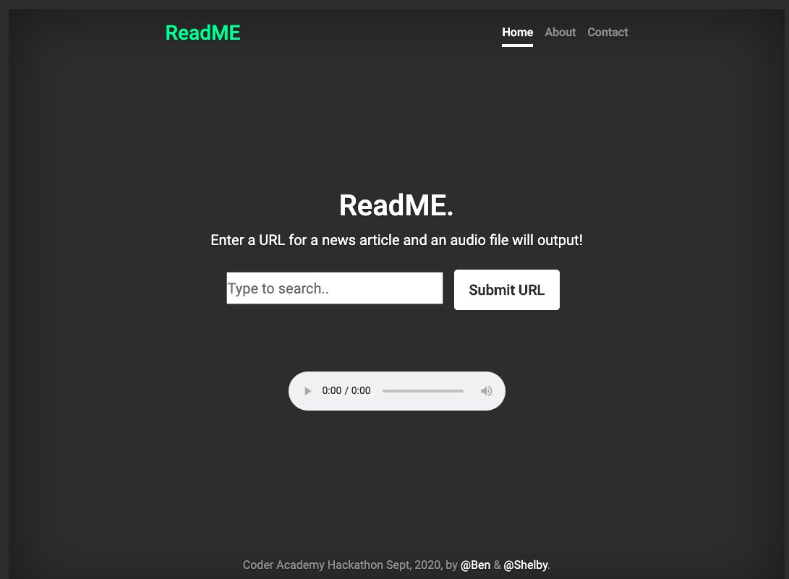

# ReadME
## Ben Rochlin & Shelby El-rassi, Flex-track 2020

## Problem to be solved?
Reading through Medium? The News? Other Articles? Ads getting in the way, or would you rather listen to an audio version? ReadMe is the article reading service you need. By inputting the URL the audio will be output ready to listen. It also is a great Accessibility tool.

## Initial Idea
- Utilising a web scraper for any news article/blog/post
- Amazon Polly
- Amazon s3 for file storage
- Service for emailing the file to user
- File be available for download
- Instant streaming

## What is ReadMe?
ReadMe is an 'article reading service' in which a user inputs a link to an article and ReadMe website converts the text from the article to audio and outputs a file that can either be downloaded or streamed  directly from the site.

## How it works?
- Amazon Identity Pool houses the AWS cred
- NPM modules used, with the help of Browserify Module which enabled these modules to be used client-side for this project
- Heroku Cors Anywhere proxy
- Instantiating a new AWS polly 
- User can input a URL into the search 
- Starts an Async function
- When loading a loading bar will appear
- Axios will then get the URL
- Cheerio will scrape the article headings and text from the page and input them into a variable
- Trimmed the story length using substring due to character limits on free AWS
- Loading stops once that article title has appended to the page and link alert appended
- On the user clicking search the get request is made then..
- Using parameters given (including the text) Amazon Polly will then Synthesize the text into a URL  the HTML Audio player for output
- Amazon Polly will also process the URL into a clickable link
- The Article Title Will Output for reference
- Notification for ready to play

## Future Features
- User being able to input their email address for the file to be sent to them
- Fine tuning of the text scraping so most articles would be compatible(Node Module Puppeteer would allow for this, however can only be used on a server)
- The output file being a downloadable audio file
- Settings Page: Choose Voice, speaking speed and other optional parameters

## Technologies Used
- Axios
- Cheerio
- Browserify
- AWS SDK
    - Amazon Polly
    - Amazon S3
- Heroku CORS Anywhere
- HTML
- CSS
- JavaScript
- jQuery

## Screenshots

## Credit

Example Article: https://medium.com/@ndaidong/zato-a-powerful-python-based-esb-solution-for-your-soa-5aef67114570
